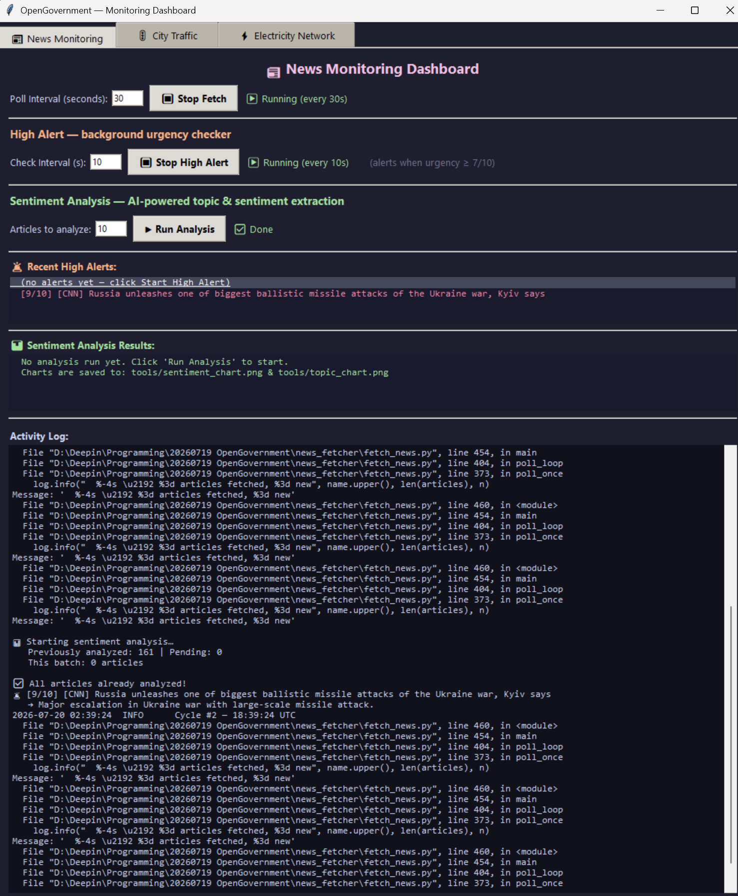
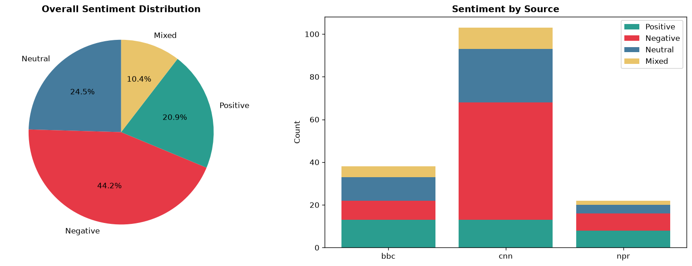
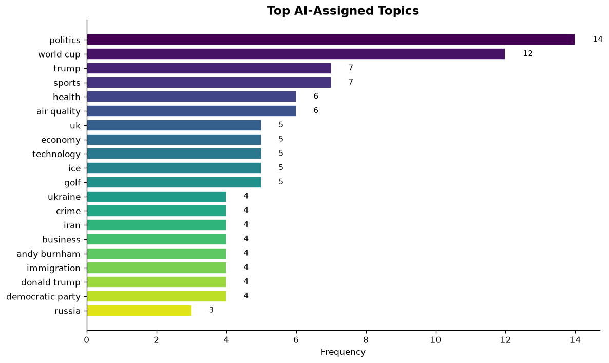

# OpenGovernment — The Open Government AI Platform

An end-to-end system that polls text-only news sources (NPR, BBC, CNN) every 60 seconds, stores headlines in SQLite with deduplication, and enriches them with DeepSeek v4 AI — sentiment analysis, topic tagging, urgency alerts, and full article body extraction.

---

## 📸 Screenshots

### 🖥️ Monitoring Dashboard (tkinter GUI)


### 📊 AI Sentiment Analysis Charts
  

---

## 🗂️ Project Structure

```
OpenGovernment/
├── 📁 news_fetcher/        ← Live news poller
│   ├── fetch_news.py       ← 60s polling loop (NPR/BBC/CNN → SQLite)
│   ├── 20260720 news_analysis.ipynb  ← DB exploration & analysis notebook
│   ├── news.db             ← SQLite database (WAL mode, concurrent-safe)
│   └── requirements.txt
│
├── 📁 ai_analysis/         ← AI analysis with DeepSeek v4
│   ├── .env                ← DEEPSEEK_API_KEY (excluded from git)
│   ├── live_ai_analyzer.py ← Continuous AI analyzer (runs alongside poller)
│   ├── analyze_news.py     ← CLI: batch AI analysis
│   ├── 20260720 ai_analysis.ipynb ← AI analysis notebook
│   └── requirements.txt
│
├── 📁 tools/               ← Monitoring GUI + alert/sentiment modules
│   ├── news_monitor_ui.py  ← 🖱️ Main UI (tkinter, 3-tab layout)
│   ├── high_alert.py       ← 🚨 Async urgency checker (DeepSeek, 1-10 scale)
│   ├── sentiment_tool.py   ← 🎭 AI sentiment & chart generator
│   ├── alerts.json         ← Alert history log
│   ├── sentiment_chart.png ← Generated chart
│   ├── topic_chart.png     ← Generated chart
│   └── requirements.txt
│
├── 📁 news_monitor/        ← News sources reference
│   └── 20260719 news_sources_reference.ipynb
│
├── 📁 assets/              ← Screenshots & charts for documentation
│   ├── ui_main_window.png
│   ├── sentiment_chart.png
│   └── topic_chart.png
│
└── README.md
```

---

## 🚀 Quick Start

### 1. Install Dependencies

```powershell
pip install -r news_fetcher/requirements.txt
pip install -r ai_analysis/requirements.txt
pip install -r tools/requirements.txt
```

### 2. Set Up API Key

Create or edit `ai_analysis/.env`:

```
DEEPSEEK_API_KEY=sk-your-key-here
```

> 💡 Current recommended models: `deepseek-v4-pro` or `deepseek-v4-flash`.

### 3. Start the System

Run all three in separate terminals:

| Terminal | Command | Purpose |
|:---:|---|---|
| **1** | `cd news_fetcher && python fetch_news.py` | Polls NPR/BBC/CNN every 60s → `news.db` |
| **2** | `cd ai_analysis && python live_ai_analyzer.py` | Reads new articles → DeepSeek AI → writes results |
| **3** | `python tools/news_monitor_ui.py` | 🖱️ GUI dashboard with fetch/alerts/sentiment |

All three share `news.db` via **WAL mode** — zero lock conflicts.

---

## 🗄️ Database Schema

```
articles (
    id            INTEGER PRIMARY KEY,
    source        TEXT,               -- 'npr' | 'bbc' | 'cnn'
    title         TEXT,               -- headline (updated each poll)
    url           TEXT UNIQUE,        ← deduplication key
    first_seen_at TEXT,               -- first discovery (never changes)
    last_seen_at  TEXT,               -- most recent poll confirmation
    published_at  TEXT,               -- from publisher (BBC RSS)
    snippet       TEXT,               -- RSS description
    content       TEXT,               -- full article body (fetched once)
    has_body      INTEGER DEFAULT 0,  -- 0=not fetched, 1=fetched

    -- AI columns (added by ai_analysis tools)
    ai_summary    TEXT,               -- one-sentence AI summary
    ai_sentiment  TEXT,               -- positive|negative|neutral|mixed
    ai_topics     TEXT,               -- comma-separated topic tags
    ai_analyzed_at TEXT,              -- when AI analysis ran

    -- Alert columns (added by high_alert.py)
    alert_urgency TEXT,               -- 1-10 urgency score
    alert_reason  TEXT,               -- why this urgency
    alert_checked_at TEXT             -- when checked
)
```

---

## 🔑 Deduplication Strategy

`url` column has a `UNIQUE` constraint. Same headline across sources (e.g., "US airstrikes on Iran" on both NPR and BBC) = different URLs → both stored. Within the same source, `INSERT OR IGNORE` prevents duplicates. Each poll cycle updates `last_seen_at` and `title` for existing URLs.

---

## 🤖 AI Features

| Feature | Implementation | Trigger |
|---|---|---|
| **Sentiment Analysis** | DeepSeek v4 → summary, sentiment, topics | On-demand (notebook Cell 3) or continuous (`live_ai_analyzer.py`) |
| **High Alert** | DeepSeek v4 → urgency 1-10, alerts at ≥ 7 | Background async every 10s (GUI or `high_alert.py`) |
| **Deep-Dive** | Full body text → entities, themes, bias | Notebook Cell 7 |
| **Charts** | matplotlib → pie + stacked bar + topic frequency | On click in GUI or `sentiment_tool.py` |

---

## 🖱️ GUI Dashboard

`tools/news_monitor_ui.py` — 3 tabs:

| Tab | Status |
|:---:|:---:|
| **📰 News Monitoring** | ✅ Active — Fetch, Alerts, Sentiment |
| 🚦 City Traffic | Placeholder |
| ⚡ Electricity Network | Placeholder |

### News Tab Sections
- **Fetch Control** — start/stop polling, adjustable interval
- **High Alert Panel** — real-time urgency listbox (red/bold for ≥ 7)
- **Sentiment Panel** — breakdown + top topics + chart file paths
- **Activity Log** — scrollable log output
- **Run Analysis** — one-click AI sentiment + chart generation

---

## 📚 Notebooks

| Notebook | Folder | Purpose |
|---|---|---|
| `20260720 news_analysis.ipynb` | `news_fetcher/` | DB connection, fetch, body text, hourly trend, keywords |
| `20260720 ai_analysis.ipynb` | `ai_analysis/` | Setup, batch AI analysis, sentiment/topic charts, deep-dive |
| `20260719 news_sources_reference.ipynb` | `news_monitor/` | 30+ text-only news sources catalog |

---

## 🔧 CLI Tools

| Script | Example Usage |
|---|---|
| `analyze_news.py` | `--recent 20`, `--source npr`, `--full`, `--dry-run` |
| `sentiment_tool.py` | `python sentiment_tool.py 15` |
| `high_alert.py` | `python high_alert.py` (continuous loop) |

---

## 📊 Data Pipeline

```
text.npr.org ──────┐
feeds.bbci.co.uk ──┤  every 60s  ┌──────────┐   reads    ┌────────────────┐
lite.cnn.com ──────┘ ──────────→ │  news.db │──────────→│ DeepSeek v4 AI │
                                 │ (SQLite) │←──────────│ (OpenAI API)   │
                                 │ WAL mode │  writes   │ sentiment      │
                                 └──────────┘           │ topics         │
                                                        │ alerts         │
                                                        └────────────────┘
```

---

## 📦 Dependencies

- Python 3.11+, `requests`, `beautifulsoup4`, `lxml`, `openai`, `python-dotenv`, `pandas`, `matplotlib`, `tkinter`

---

## 📝 Version History

| Version | Date | Changes |
|---|---|---|
| v1.0 | 2026-07-19 | Initial: news sources, fetch_news.py, SQLite |
| v1.3 | 2026-07-19 | Browser verification of URLs, dead domains removed |
| v1.5 | 2026-07-20 | RSS section, GDELT integration |
| v1.6 | 2026-07-20 | `first_seen_at`/`last_seen_at` split, `has_body` flag, two-phase polling |
| v2.0 | 2026-07-20 | DeepSeek v4 AI, live_ai_analyzer, sentiment/alert tools |
| v2.1 | 2026-07-20 | GUI dashboard, high alert checker, chart generation |
